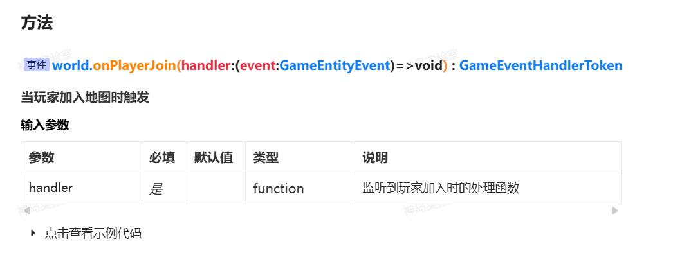

> 事件，特别是在onXXX和nextXXXX这类方法中，它们均作为BOX3的监听事件函数。
> 这些方法涉及回调函数或异步操作，**但在本文档中，我们选择了大家比较常用的方式，也为了保持一致性，我们统一采用回调函数的形式来展示（特指onXXX方法）。**
> 这样的处理方式有助于简化文档结构，确保读者能够更直观地理解这些方法的用途和行为。

例如：

使用**回调函数**形式调用：onXXXX
```javascript
// 玩家进入地图时，向TA发送一条私信。
world.onPlayerJoin(({ entity }) => {
  entity.player.directMessage(`你好，${entity.player.name}`);
});
```

使用**异步**形式调用：nextXXX
```javascript
//等待玩家进入游戏，向TA发送一条私信。执行一次后续不再执行
async function waitForPlayers() {
  const { entity } = await world.nextPlayerJoin();
  entity.player.directMessage(`你好，${entity.player.name}`);
}
//调用异步函数
waitForPlayers();

//-或-
(async () => {
  const { entity } = await world.nextPlayerJoin();
  entity.player.directMessage(`你好，${entity.player.name}`);
})();
```

这两个代码片段都用于在玩家进入游戏时发送私信，但它们在执行时机和代码结构上有所不同。

1. `**nextPlayerJoin()**`** 函数：** 
   - 这个函数是一个异步函数，使用 `await` 关键字等待 `world.nextPlayerJoin()` 返回新的玩家实体。
   - 当有新玩家加入时，它使用 `entity.player.directMessage()` 向该玩家发送私信。
   - 这个函数是同步执行的，意味着它会一直等待直到有新玩家加入。
2. `**onPlayerJoin()**`** 函数：** 
   - 这个监听器使用了 `world.onPlayerJoin` 方法，这是一个事件监听器，当有新玩家加入时会被触发。
   - 它接收一个回调函数，这个函数会在每次有新玩家加入时执行。
   - 在回调函数中，使用 `entity.player.directMessage()` 向新加入的玩家发送私信。
   - 这个监听器可以处理多个玩家加入的情况，而 waitForPlayers() 函数只能处理第一个加入的玩家。
- `**world.nextPlayerJoin**()` 函数通过异步等待实现对每个新加入的玩家发送私信，代码更简洁。
- `**world.onPlayerJoin()**` 监听器适合在需要更灵活地处理多个玩家加入的情况时使用，可以添加更复杂的逻辑。


## (async()=>{})();是什么？
这个写法是 JavaScript 中的一种常见模式，用于异步执行一个函数。具体来说，它是一个立即执行的异步函数。

这个结构的工作原理如下：

1. `(async () => { ... })()` 创建了一个立即执行的函数表达式。
2. `async` 关键字表明这个函数是一个异步函数。
3. 函数体 `() => { ... }` 包含你想要异步执行的代码。
4. 整个表达式被立即调用，即执行。

这种写法通常用于异步操作，比如异步请求数据或执行一些需要等待的操作。由于它是立即执行的，所以它通常用于需要立即开始异步操作的场景。

例如，如果你想要在网页加载完成后立即执行一个异步操作，你可以这样写：
```javascript
(async () => {
  // 这里可以放置需要异步执行的代码，比如异步请求数据
})();
```
在这个例子中，异步操作会在网页加载完成后立即开始执行。


## 异步等待会影响游戏性能吗？
异步等待，特别是使用 `async/await` 语法，通常不会直接影响游戏性能。然而，其影响取决于如何使用和在哪里使用它们。

1. **性能影响：** 
   - **局部性：** 异步操作通常在代码的局部位置进行，如在玩家交互或特定事件触发时。这种局部性意味着它们不会频繁地阻塞游戏主线程，因此对性能的影响较小。
   - **并发性：** 异步操作允许游戏在等待某些操作完成的同时继续处理其他任务，这可以提高游戏的响应速度和流畅性。
2. **潜在问题：** 
   - **过度使用：** 如果在一个频繁调用的循环中过度使用异步操作，可能会导致不必要的等待和上下文切换，这可能会影响性能。
   - **长时间等待：** 如果异步操作需要很长时间才能完成，且没有适当的处理，可能会导致玩家体验下降，感觉游戏卡顿。
3. **最佳实践：** 
   - **避免阻塞主线程：** 确保异步操作不会长时间阻塞主线程，特别是在游戏的主要渲染循环中。
   - **合理使用：** 异步操作应仅用于需要长时间等待的任务，如网络请求或复杂的计算。
   - **优化异步流程：** 使用异步操作时，应确保它们是高效的，避免不必要的等待和资源消耗。

总的来说，异步等待可以提高代码的清晰度和可维护性，同时在不适当使用的情况下可能会影响性能。因此，关键在于合理和谨慎地使用它们。
