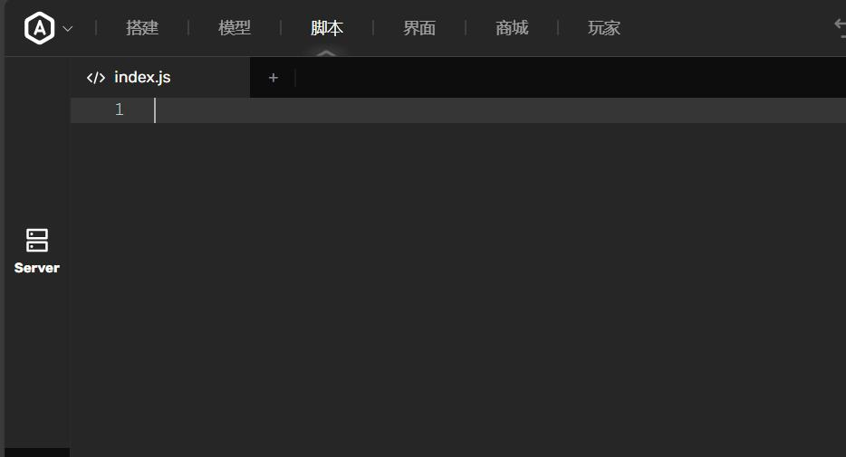
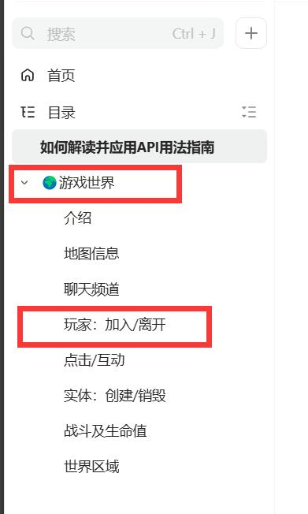
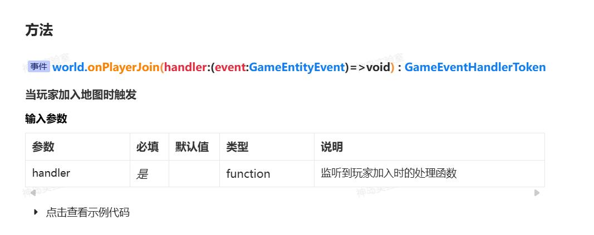
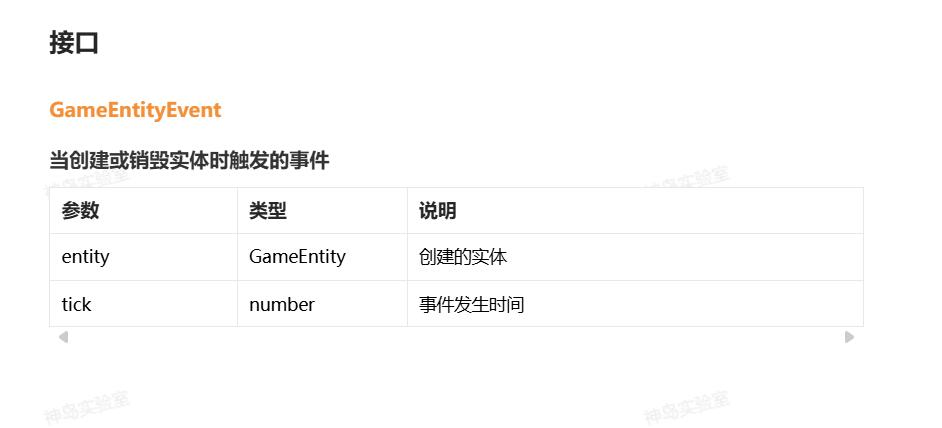
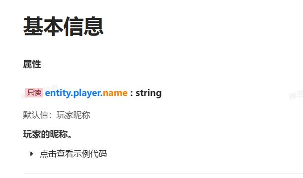

:::warning
在阅读本文章之前，我们默认你已具备JavaScript基础知识，如变量、条件判断、循环和函数等，因此这些内容将不再赘述。
:::
> 本文旨在覆盖广泛的人群，特别是考虑到初学者的需求，因此在解释和说明上可能会显得相对详细。如果你已经对相关内容有所了解，或者希望更快地浏览信息，你可以选择性地跳过部分内容。我们理解每个人的学习速度和兴趣点都有所不同，因此提供了丰富的内容供你选择。感谢你的理解和耐心阅读，希望对你有所帮助。

本次我们将通过一个入门案例，引导你尝试写一个游戏功能并理解BOX API的使用方法。这是你入门BOX API的关键一步，请跟着我们一步步操作。


## 功能需求
1.当有玩家进入游戏时，发一条广播让所有人都能看到，内容是：嘿，各位，又有一位新朋友【玩家名称】来啦，大家欢迎！

2.当有玩家按下鼠标右键时，发一条广播，内容是：【玩家名称】按下了鼠标右键！


## 功能分析
根据以上的需求分析，分析得到了可能需要以下接口：

1. **玩家进入游戏接口**：这个接口用于在玩家进入游戏时触发。通知系统玩家已经加入游戏，随后，我们可以根据自己设置的代码逻辑进行相应处理。
2. **获取玩家昵称**：这个接口用于获取玩家的昵称。
3. **全局广播接口**：这是一个所有人都能接收到的广播接口。当玩家加入游戏时，我们可以利用此接口向所有在线玩家发送广播，告知新玩家的加入。
4. **鼠标事件检测接口**：此接口用于检测玩家在游戏内是否按下了鼠标。

综上所述，共需要上述四个接口。需要在BOX3 API文档中查找。


## 阅读本文需要具备的知识
在继续深入之前，为了确保你能够充分理解本案例的内容，建议先掌握以下几个关键知识点：
**数据类型：**了解不同数据类型的定义和用法，如整数、浮点数、字符串、布尔值等，以及它们在编程中的重要作用。:::info
在JavaScript的世界里，数据类型就像是各种小盒子，它们可以装下不同的东西。这些“小盒子”叫做数据类型，而它们装的东西可以是数字、文字、布尔值（就是真或假）等等。下面我给你介绍几种常见的JavaScript数据类型：

1. **数字（number）盒子**：这个盒子里可以装整数（没有小数点的数字）和浮点数（有小数点的数字）。比如，你可以把123或者3.14装在这个盒子里。
2. **文字（string）盒子**：这个盒子里装的是文字或者叫字符串。它们是由很多个字符（比如字母、数字、标点符号）组成的。比如，“Hello, World!”就是一个字符串，它可以装在这个盒子里。
3. **布尔（boolean）盒子**：这个盒子很特别，它只能装两个东西，一个是“真”（true），一个是“假”（false）。它通常用来表示某些条件是否成立。
4. **其他盒子**：除了上面这些，还有一些其他的盒子，比如用来装图片、声音、视频等多媒体内容的盒子。

在JavaScript中，当你需要存储或操作某个东西时，就需要选择一个合适的“盒子”来装它。这样，计算机就能更好地理解你的指令，并正确地执行它们了。
:::
**函数**：函数是执行特定任务的代码块，它们接收输入（称为形式参数或形参）并可能返回输出（称为返回值）。理解函数的定义、调用以及它们如何传递和接收数据是编程的基础。:::info
想象一下，函数就像一个魔法盒子，它有一个特殊的本领，可以帮你完成一些任务。当你告诉它做什么时，它就会按照你的指示去做。

**1. 函数**

函数就像一个魔法盒子，它有一个名字（我们称之为函数名），就像“变魔术”或者“做算术”。当你想要这个魔法盒子执行它的本领时，你就“叫”它的名字。

**2. 形式参数（形参）**

有时候，这个魔法盒子需要一些帮助来完成它的任务。就像你在做蛋糕时需要鸡蛋、糖和面粉一样。这些“帮助”就是形式参数。当你定义函数时，你会告诉它它可能需要哪些“帮助”，也就是定义形式参数。

**3. 实际参数（实参）**

当你真正想要使用这个魔法盒子的本领时，你需要给它提供它所需要的“帮助”。这些你实际给它的“帮助”就是实际参数。就像你在做蛋糕时，你真正放进了鸡蛋、糖和面粉一样。

**4. 返回值**

当魔法盒子完成了它的任务后，它可能会给你一些“回报”。这个“回报”就是返回值。就像你完成了一个拼图后，你得到了一个完整的图画作为回报一样。

举个例子，我们有一个叫做“加法”的函数。这个函数的形式参数是两个数字，比如“a”和“b”。当你真正使用这个函数并给它两个数字作为实际参数，比如3和5时，它就会把这两个数字加起来，并返回结果8作为返回值。
:::
**JSON：**JSON（JavaScript Object Notation）是一种轻量级的数据交换格式，它基于ECMAScript的一个子集，采用完全独立于语言的文本格式来存储和表示数据。JSON对象是一个无序的“‘名称/值’对”集合。了解JSON的语法和结构，以及如何在编程中使用它来解析和生成数据，对于与服务器进行交互和处理数据非常重要。:::info
你知道当我们想要告诉朋友一些信息，比如你的生日、你喜欢的食物或者你的家在哪里时，我们通常会用语言来描述这些信息。但是，在JavaScript的世界里，计算机并不能直接理解我们说的话，所以我们需要用一种特殊的“语言”来告诉计算机这些信息，这种“语言”就是JSON。

JSON就像是一种特殊的笔记本，我们可以把想要告诉计算机的信息都写在这个笔记本上。但是，这个笔记本有它自己的规则哦！

- 首先，每个信息都要有一个名字，就像你在课本上看到的“姓名”、“年龄”这样的标题一样。在JSON里，我们称这些名字为“键”（key）。
- 然后，我们要在键的旁边写下对应的信息，这些信息就是“值”（value）。比如，如果键是“姓名”，那么值可能就是你的名字“小明”。
- 这些键和值会放在一起，形成一个“键值对”（key-value pair）。每个键值对都会用逗号分隔开，就像你在课本上看到的句子一样。
- 最后，所有的键值对都会放在一个大括号里，这样计算机就能很容易地找到并读懂这些信息了。

举个例子，如果你想告诉计算机你的姓名、年龄和喜欢的食物，你可以这样写：
:::
```json
{
    "姓名": "小明",
    "年龄": 8,
    "喜欢的食物": "冰淇淋"
}
```
:::info
在这个例子里，“姓名”、“年龄”和“喜欢的食物”就是键，而“小明”、8和“冰淇淋”就是对应的值。

这样，当你想让计算机做一些事情，比如显示你的信息或者保存你的信息时，你就可以把这个JSON笔记本给它看，它就会按照你的要求来做了。
:::
**接口：**接口定义了一组方法，但没有实现这些方法。它允许不同的类实现相同的方法集，从而确保它们之间的兼容性和一致性。在编程中，接口是实现多态性的关键工具。了解如何定义和使用接口可以帮助你创建可扩展和可维护的代码。:::info
你知道有时候我们会和好朋友一起玩游戏，但玩游戏之前，我们会先约定好游戏的规则，比如谁先来、怎么得分等等。这些规则就是游戏里的“接口”。

在JavaScript的世界里，接口也是一种“规则”，但它不是用来玩游戏的，而是用来帮助计算机程序员编写更好的代码。

想象一下，如果你有一个好朋友，他/她有一个超能力，就是可以画画。但是，你并不知道他/她具体是怎么画画的，因为每个人画画的方式可能都不一样。但是，你可以和他/她约定一个“接口”，比如：“当我给你一张白纸和一支笔，你就给我画一只小猫。” 这样，不管你的朋友怎么画这只小猫，你都知道他/她会给你一只画好的小猫。

在JavaScript中，接口就像这样的约定。程序员们会先定义好一个接口，规定好某个对象应该有哪些方法和属性。然后，其他的对象就可以按照这个接口来实现自己的功能。这样，只要一个对象实现了某个接口，我们就可以确定它拥有接口里规定的方法和属性，而不必关心它是怎么实现的。

比如，我们可以定义一个“画画”的接口，规定它应该有一个“drawCat”的方法。然后，有一个对象叫做“小明”，他/她实现了这个接口，并且用他/她的方式实现了“drawCat”这个方法。这样，我们就可以让小明给我们画一只小猫，而不用担心他/她是怎么画出来的。
:::
**枚举**：枚举是一种特殊的数据类型，它允许你为一组相关的值定义名称。这些值通常是一组固定的常量，例如，你可能有一个枚举来表示一周的几天或一套可能的订单状态。使用枚举可以提高代码的可读性和可维护性，因为它们为常量值提供了有意义的名称，而不是使用裸露的数字或字符串。:::info
当我们有很多类似的东西，并且想要给它们每一个都起一个容易记住的名字时，我们就可以使用“枚举”。在JavaScript中，枚举就像是一个列表，里面包含了一些特殊的值，每个值都有一个与之对应的名字。

想象一下，如果你有很多颜色的蜡笔，你可能会想要给每种颜色都起一个名字，比如“红色”、“蓝色”和“绿色”。这样，当你想要使用红色的蜡笔时，你就可以直接告诉其他人“我要红色的蜡笔”，而不用每次都描述那个颜色是什么样子的。

在JavaScript中，枚举就是这样工作的。我们可以创建一个枚举，给每种颜色一个名字，然后当我们想要使用某种颜色时，我们就可以直接引用它的名字，而不是每次都写出那个颜色的具体值。

比如，我们可以创建一个叫做“Colors”的枚举，里面包含“Red”、“Blue”和“Green”这几个值。然后，当我们编写代码时，我们就可以直接使用“Colors.Red”来表示红色，而不是每次都写出红色的具体代码。

这样，代码就会变得更加清晰和容易理解，因为我们可以直接看到我们正在使用的颜色的名字，而不是一串可能让人困惑的代码。
:::

## 开始

#### 第一步：准备
请点击地图编辑器的“脚本”按钮，随后进入index.js界面，开始代码编写。



#### 第二步：加入事件，查阅文档
**1：查阅玩家进入游戏的接口**

我们在**游戏世界**分类中，能看到一个叫做[**玩家：加入/离开**](https://www.yuque.com/box3lab/api/ok49sqk24sfmx46u)的分类，点击它。





我们找到相关关键字，玩家加入地图时触发，和我们的需求非常的相似。
:::warning
**提示：**你也可以看看示例代码，它会告诉你如何使用。你也可以直接复制粘贴到游戏编辑器中，运行。但我们不建议这么做，因为复制别人的代码，自己不加思考是很难学到知识。
:::

> 我来给你解释一下 `**world.onPlayerJoin(handler:(event:GameEntityEvent)=>void):GameEventHandlerToken**`这个在JavaScript中的代码片段是什么意思。
> 首先，我们知道在一个游戏中，有时候会有新的玩家加入。当我们说“新的玩家加入”时，我们其实是在说游戏中的一个“事件”发生了。
> 1.  `**onPlayerJoin**`：这是一个函数的名字。你可以想象它就像一个邮筒，当新的玩家加入游戏时，邮筒就会收到一封信（也就是一个消息）。 
> 2.  `**handler:(event:GameEntityEvent)=>void**`：这是`onPlayerJoin`函数的参数。但你可能不知道“回调”是什么意思。简单来说，回调就是当某个事情发生时，我们想要做的另一件事情。在这个例子中，当新玩家加入时，我们可能想要显示一个消息，或者做一些其他的事情。 
>    - `**event:GameEntityEvent**`：这是回调函数的参数。它告诉我们哪个玩家加入了游戏，或者关于这个玩家的其他信息。`GameEntityEvent`是一个包含了玩家信息的对象。
>    - `**=>void**`：这表示回调函数不会返回任何东西。`void`就像是说：“我什么都不会带回家的！”
> 3.  `**:GameEventHandlerToken**`：这是`onPlayerJoin`函数的返回类型。但在这个例子中，函数会返回该事件的唯一标识符，用于该事件后续操作。 
> 
所以，整个`world.onPlayerJoin`函数就像是一个邮筒，在游戏世界中，当你把一封信（回调函数）放进邮筒时，如果有一个新玩家加入游戏（事件发生了），邮筒就会自动帮你把信寄出去（执行回调函数）。


这里有个BOX3定义的一个接口对象`**GameEntityEvent**`，他并不是JavaScript自带的内容，我们需要看看它是如何定义的。



我们知道`GameEntityEvent`存在两个参数，通过读取这个参数可以获取到对应的数据。

**2：查阅获取玩家昵称接口**

我们在**游戏玩家**分类中，能看到一个叫做[**基本信息**](https://www.yuque.com/box3lab/api/inriuuvzg5yb54kv)的分类，点击它。


> 我来给你解释一下 `**只读 entity.player.name:string**` 这个在JavaScript中的代码片段是什么意思。
> 想象一下你有一个写着“name”的纸条盒子，这个盒子里装了一些纸条（字符串）。但是，这个盒子有一个特殊的盖子，它只能打开来读取里面的纸条，但你不能通过打开盖子来放入新的纸条或者更改里面的纸条。这就是“只读”的意思。
> 在编程中，当我们说一个属性或变量是“只读”的，就意味着我们可以查看它的值，但不可以改变它。这是为了确保数据的安全性和一致性，防止程序中的其他部分不小心或错误地修改了它。
> 所以，“只读”的 entity.player.name: string 就是告诉我们：在玩家对象下面，有一个叫“name”的纸条盒子，它里面装的是纸条（字符串），但我们只能打开它来看纸条上的内容，不能改变它。

所以，我们可以通过以下方式，获取到新加入地图的玩家的昵称。
```javascript
// 玩家进入地图时，获取该玩家的昵称
world.onPlayerJoin(({entity}) => {
  console.log(entity.player.name);
});
```

---

**3：查阅全局广播接口**

