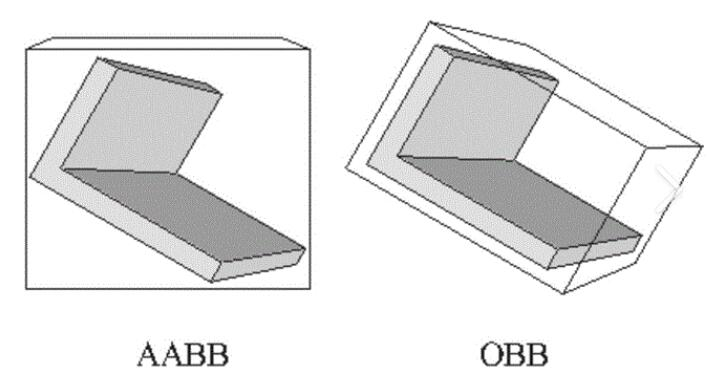

### 属性

#### **world.**useOBB : boolean 
默认值：false

**世界是否切换为OBB包围盒？反之为AABB包围盒。**


:::warning
⚠️启用OBB模式后，系统的性能表现会受到一定程度的影响。

由于OBB能够更紧密地贴合物体形状，它在碰撞检测中可能更为精确，但同时也会增加一定的计算负担，导致性能上的细微下降。

因此，决定是否启用OBB模式时，需要综合考虑其对性能的影响以及应用场景的具体需求。
:::

---


#### **world.**gravity : number      
默认值：-0.1

**世界重力。对应编辑器菜单 [场景-物理-地心引力] 控件属性。

数值越小，行动越笨重。受重力影响最明显的属性是跳跃高度及下落速度。如果重力数值大于0，可以实现反重力。**
::: details 点击查看示例代码
```javascript
/* Example：点击鼠标左键，切换重力方向。*/

// 使用变量来记录重力反转的状态。
let toggleGravity = false

// 监听鼠标点击事件
world.onPress(({ button }) => {
  // 点击鼠标左键
  if (button === GameButtonType.ACTION0) {   // 切换开关状态
    // true变成false, false变成true.
    toggleGravity = !toggleGravity   // 修改重力数值
    // 如果true, 反向重力。如果false，恢复默认重力。
    world.gravity = toggleGravity ? -0.5 * world.gravity : -0.1   // 向玩家提供反馈
    world.say(`重力状态: ${toggleGravity ? '上升' : '落下'}`)
  }
});
```
:::
---


#### **world.**airFriction : number     
默认值：0.001

范围：0-1

**空1气阻力。对应编辑器菜单 [场景-速度阻尼] 控件属性。

数值越大，行走加速度越小。可以用来模拟大风的环境。**


### **方法**

#### 事件**world.**onEntityContact(handler:(event:GameEntityContactEvent)=>void) : [GameEventHandlerToken](https://www.yuque.com/box3lab/api/gll7mhwasgn9hoq0)
**当实体与实体发生碰撞时触发。**

**输入参数**

| **_参数_** | **_必填_** | **_默认值_** | **_类型_** | **_说明_** |
| --- | --- | --- | --- | --- |
| handler | _是_ | | function | 碰撞时的处理函数 |

**返回值**

| **类型** | **说明** |
| --- | --- |
| GameEntityContactEvent | 碰撞结果 |

::: details 点击查看示例代码
```javascript
/* 两个实体进行碰撞时，广播一条消息 */
world.onEntityContact(({ entity, other }) => {
  const entityA = entity.isPlayer ? entity.player.name : entity.id;
  const entityB = other.isPlayer ? other.player.name : other.id;
  world.say(`

$$
{entityA}和
$$
{entityB}发生了激烈的碰撞`)
});
```
```javascript
/* 玩家碰到包含 'healpoint' 标签的实体，回复全部HP */
world.onEntityContact(({ entity, other }) => {
  if (!entity.isPlayer || !other.hasTag('healpoint')) return;
  if (entity.hp < entity.maxHp) { // 恢复全部HP
    entity.hp = entity.maxHp;
    entity.player.directMessage('你回复了全部的HP');
  }
});
```
```javascript
/* 玩家碰到实体时，将自身变成实体的造型 */
world.onEntityContact(({ entity, other }) => {
  if (entity.isPlayer && !other.isPlayer) {
    fakeObject(entity, other);
  }
});

function fakeObject(player, object) {
  player.mesh = object.mesh;
  player.meshOrientation = object.meshOrientation;
  player.meshScale = object.meshScale;
  player.player.showName = false;
}
```
:::
---


#### 事件**world.**onEntitySeparate(handler:(event:GameEntityContactEvent)=>void) : [GameEventHandlerToken](https://www.yuque.com/box3lab/api/gll7mhwasgn9hoq0)
**当实体与实体结束碰撞时触发。**

**输入参数**

| **_参数_** | **_必填_** | **_默认值_** | **_类型_** | **_说明_** |
| --- | --- | --- | --- | --- |
| handler | _是_ | | function | 碰撞后时的处理函数 |

**返回值**

| **类型** | **说明** |
| --- | --- |
| GameEntityContactEvent | 碰撞结果 |

::: details 点击查看示例代码
```javascript
// 实体开始碰撞
world.onEntityContact(({ entity, other }) => {
  console.log('开始碰撞')
})

// 实体停止碰撞
world.onEntitySeparate(({ entity, other }) => {
  console.log('停止碰撞')
})
```
```javascript
/* 玩家碰到实体时，将自身变成实体的造型 */
world.onEntityContact(({ entity, other }) => {
  if (entity.isPlayer && !other.isPlayer) {
    fakeObject(entity, other);
  }
});

function fakeObject(player, object) {
  player.mesh = object.mesh;
  player.meshOrientation = object.meshOrientation;
  player.meshScale = object.meshScale;
  player.player.showName = false;
}
```
```javascript
/* 玩家碰到包含 'healpoint' 标签的实体，回复全部HP */
world.onEntityContact(({ entity, other }) => {
  if (!entity.isPlayer || !other.hasTag('healpoint')) return;
  if (entity.hp < entity.maxHp) { // 恢复全部HP
    entity.hp = entity.maxHp;
    entity.player.directMessage('你回复了全部的HP');
  }
});
```
:::
---


#### 事件**world.**onVoxelContact(handler:(event:GameVoxelContactEvent)=>void) : [GameEventHandlerToken](https://www.yuque.com/box3lab/api/gll7mhwasgn9hoq0)
**当实体与方块发生碰撞时触发。**

**输入参数**

| **_参数_** | **_必填_** | **_默认值_** | **_类型_** | **_说明_** |
| --- | --- | --- | --- | --- |
| handler | _是_ | | function | 碰撞后时的处理函数 |

**返回值**

| **类型** | **说明** |
| --- | --- |
| GameVoxelContactEvent | 碰撞结果 |

::: details 点击查看示例代码
```javascript
/* 如果实体碰到冰块，冰块会被打破 */
world.onVoxelContact(({ x, y, z, voxel }) => {
  const voxelName = voxels.name(voxel);  // 将方块id转换名称
  if (voxelName === 'ice'){              // 如果方块名称是冰块
    voxels.setVoxel(x, y, z, 0);       // 将方块变成空气
  }
});
```
```javascript
// 检测玩家脚下的方块是否为石头
world.onVoxelContact(({ entity, voxel, axis }) => {
  if (!entity.isPlayer) return;                 // 如果碰到方块的不是玩家，则跳过
  const voxelName = voxels.name(voxel);         // 将方块id转换名称
  if (voxelName === 'stone' && axis.y === 1){   // 如果方块名称是石头，并且在玩家下方
    console.log(`

$$
{entity.player.name} 脚下踩着 
$$
{voxelName} 方块`)
  }
});
```
```javascript
/* 玩家碰到包含 'healpoint' 标签的实体，回复全部HP */
world.onEntityContact(({ entity, other }) => {
  if (!entity.isPlayer || !other.hasTag('healpoint')) return;
  if (entity.hp < entity.maxHp) { // 恢复全部HP
    entity.hp = entity.maxHp;
    entity.player.directMessage('你回复了全部的HP');
  }
});
```
:::
---


#### 事件**world.**onVoxelSeparate(handler:(event:GameVoxelContactEvent)=>void) : [GameEventHandlerToken](https://www.yuque.com/box3lab/api/gll7mhwasgn9hoq0)
**当实体与方块结束碰撞时触发。**

**输入参数**

| **_参数_** | **_必填_** | **_默认值_** | **_类型_** | **_说明_** |
| --- | --- | --- | --- | --- |
| handler | _是_ | | function | 碰撞后时的处理函数 |

**返回值**

| **类型** | **说明** |
| --- | --- |
| GameVoxelContactEvent | 碰撞结果 |

::: details 点击查看示例代码
```javascript
// 实体接触到方块
world.onVoxelContact(({ entity, voxel }) => {
  console.log('碰撞到方块')
})

// 实体停止接触方块
world.onVoxelSeparate(({ entity, voxel }) => {
  console.log('停止碰撞')
})
```
:::
---


#### 事件**world.**onFluidEnter(handler:(event:GameFluidContactEvent)=>void) : [GameEventHandlerToken](https://www.yuque.com/box3lab/api/gll7mhwasgn9hoq0)
**当实体进入水里/液体时触发。**

**输入参数**

| **_参数_** | **_必填_** | **_默认值_** | **_类型_** | **_说明_** |
| --- | --- | --- | --- | --- |
| handler | _是_ | | function | 进入后时的处理函数 |

**返回值**

| **类型** | **说明** |
| --- | --- |
| GameFluidContactEvent | 碰撞结果 |

::: details 点击查看示例代码
```javascript
// 有玩家接触到液体时，在控制台提示玩家的名字
world.onFluidEnter(({ entity, voxel})=>{
  if (!entity.isPlayer) return;
  const voxelName = voxels.name(voxel);
  console.log(`

$$
{entity.player.name} 进入了 
$$
{voxelName}`)
})
```
:::
---


#### 事件**world.**onFluidLeave(handler:(event:GameFluidContactEvent)=>void) : [GameEventHandlerToken](https://www.yuque.com/box3lab/api/gll7mhwasgn9hoq0)
**当实体离开水里/液体时触发。**

**输入参数**

| **_参数_** | **_必填_** | **_默认值_** | **_类型_** | **_说明_** |
| --- | --- | --- | --- | --- |
| handler | _是_ | | function | 离开后时的处理函数 |

**返回值**

| **类型** | **说明** |
| --- | --- |
| GameFluidContactEvent | 碰撞结果 |

::: details 点击查看示例代码
```javascript
// 实体接触到液体时
world.onFluidEnter(({ entity, voxel}) => {
  console.log('接触到液体')
})

// 实体离开液体时
world.onFluidLeave(({ entity, voxel}) => {
  console.log('停止接触液体')
})
```
:::
---


#### **world.**addCollisionFilter(aSelector:[GameSelectorString](https://www.yuque.com/box3lab/api/ur5fw9xs38ztuvck#wOD86),bSelector:[GameSelectorString](https://www.yuque.com/box3lab/api/ur5fw9xs38ztuvck#wOD86)) : void
**添加碰撞过滤器，关闭两个实体组之间的碰撞。**

**输入参数**

| **_参数_** | **_必填_** | **_默认值_** | **_类型_** | **_说明_** |
| --- | --- | --- | --- | --- |
| aSelector | _是_ | | [GameSelectorString](https://www.yuque.com/box3lab/api/ur5fw9xs38ztuvck#wOD86) | 用于定义第一组实体的选择器 |
| bSelector | _是_ | | [GameSelectorString](https://www.yuque.com/box3lab/api/ur5fw9xs38ztuvck#wOD86) | 用于定义第二组实体的选择器 |

::: details 点击查看示例代码
```javascript
// 关闭玩家和玩家之间的碰撞
world.addCollisionFilter('player','player');

// 关闭玩家和带'groupA'标签的实体之间的碰撞 
world.addCollisionFilter('.groupA','player');

// 关闭玩家和名为'entity1'的实体之间的碰撞
world.addCollisionFilter('#entity1','player');

// 关闭全部实体之间的碰撞
world.addCollisionFilter('*','*');
```
:::
---


#### **world.**removeCollisionFilter(aSelector:[GameSelectorString](https://www.yuque.com/box3lab/api/ur5fw9xs38ztuvck#wOD86),bSelector:[GameSelectorString](https://www.yuque.com/box3lab/api/ur5fw9xs38ztuvck#wOD86)) : void
**移除碰撞过滤器，不再关闭两个实体组aSelector、bSelector之间的碰撞。**

**输入参数**

| **_参数_** | **_必填_** | **_默认值_** | **_类型_** | **_说明_** |
| --- | --- | --- | --- | --- |
| aSelector | _是_ | | [GameSelectorString](https://www.yuque.com/box3lab/api/ur5fw9xs38ztuvck#wOD86) | 用于定义第一组实体的选择器 |
| bSelector | _是_ | | [GameSelectorString](https://www.yuque.com/box3lab/api/ur5fw9xs38ztuvck#wOD86) | 用于定义第二组实体的选择器 |

::: details 点击查看示例代码
```javascript
// 移除玩家和玩家之间的碰撞过滤器 remove collision filter for player & player 
world.removeCollisionFilter('player','player');

// 移除玩家和带'groupA'标签的实体之间的碰撞过滤器 remove collision filter for player & entity with tag named groupA 
world.removeCollisionFilter('.groupA','player');

// 移除玩家和名为'entity1'的实体之间的碰撞过滤器 remove collision filter for player & specific entity with id named entity1 
world.removeCollisionFilter('#entity1','player');
```
:::
---


#### **world.**clearCollisionFilters() : void
**清除全部碰撞过滤器。**

---


#### **world.**collisionFilters() : string[][]
**返回当前有效的全部碰撞过滤器。**

**返回值**

| **类型** | **说明** |
| --- | --- |
| string[][] | 当前有效的全部碰撞过滤器 |

::: details 点击查看示例代码
```javascript
// 打印全部碰撞过滤器 print all collision filters
world.collisionFilters().forEach(([ a, b ]) => console.log(a, b));
```
:::
---


#### **world.**testSelector() : boolean
**测试实体是否符合某个选择器的条件。 **

**输入参数**

| **_参数_** | **_必填_** | **_默认值_** | **_类型_** | **_说明_** |
| --- | --- | --- | --- | --- |
| selector | _是_ | | [GameSelectorString](https://www.yuque.com/box3lab/api/ur5fw9xs38ztuvck#wOD86) | 要测试的选择器 |
| entity | _是_ | | [GameEntity](https://www.yuque.com/box3lab/api/crnsxu2gtymwx013) | 要测试的实体 |

**返回值**

| **类型** | **说明** |
| --- | --- |
| boolean | true: 实体符合选择器的条件; false: 实体不符合选择器的条件 |

::: details 点击查看示例代码
```javascript
const e1 = world.createEntity({
  mesh:'mesh/花.vb',
  position:new GameVector3(64, 9, 64),
  meshScale:new GameVector3(0.1, 0.1, 0.1),
  collides:true,
  fixed:true,
});
e1.addTag('groupA');

// can use to test entity selectable with a tag
if (world.testSelector('.groupA', e1)) { 
  // 在这里插入某句执行代码
}
```
```javascript
const e1 = world.createEntity({
  id: '花朵',
  mesh:'mesh/花.vb',
  position:new GameVector3(64, 9, 64),
  meshScale:new GameVector3(0.1, 0.1, 0.1),
  collides:true,
  fixed:true,
});
e1.addTag('groupA');

// can use to test whether entity selectable with entity id 
if (world.testSelector('#花朵', e1)) {  
  // do something 
}
```
:::

### **接口**

#### GameEntityContactEvent
**当两个实体碰撞时触发的事件。**

| **参数** | **类型** | **说明** |
| --- | --- | --- |
| axis | [GameVector3](https://www.yuque.com/box3lab/api/sug8utrs043aep5v) | 碰撞的分离轴，也就是碰撞后物体弹飞的方向 |
| entity | [GameEntity](https://www.yuque.com/box3lab/api/crnsxu2gtymwx013) | 碰撞中的第一个实体 |
| force | [GameVector3](https://www.yuque.com/box3lab/api/sug8utrs043aep5v) | 碰撞所产生的力 |
| other | [GameEntity](https://www.yuque.com/box3lab/api/crnsxu2gtymwx013) | 碰撞中的第二个实体 |
| tick | number | 两个实体碰撞的时间 |


---


#### GameVoxelContactEvent
**当实体触碰方块时触发的事件。**

| **参数** | **类型** | **说明** |
| --- | --- | --- |
| axis | [GameVector3](https://www.yuque.com/box3lab/api/sug8utrs043aep5v) | 碰撞后物体弹飞的方向 |
| entity | [GameEntity](https://www.yuque.com/box3lab/api/crnsxu2gtymwx013) | 触碰方块的实体 |
| force | [GameVector3](https://www.yuque.com/box3lab/api/sug8utrs043aep5v) | 碰撞所产生的力 |
| voxel | number | 被触碰的方块 id |
| tick | number | 事件发生时间 |
| x | number | 被触碰方块的 x 坐标 |
| y | number | 被触碰方块的 y 坐标 |
| z | number | 被触碰方块的 z 坐标 |


---


#### GameFluidContactEvent
**当实体进入或离开液体时触发的事件。**

| **参数** | **类型** | **说明** |
| --- | --- | --- |
| entity | [GameEntity](https://www.yuque.com/box3lab/api/crnsxu2gtymwx013) | 触碰液体的实体 |
| voxel | number | 触碰的液体方块 |
| tick | number | 事件发生时间 |

