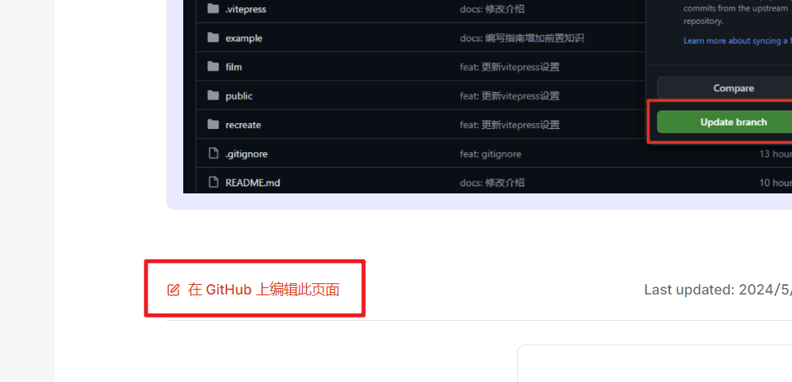
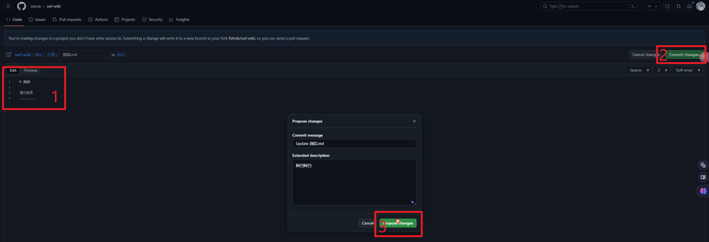
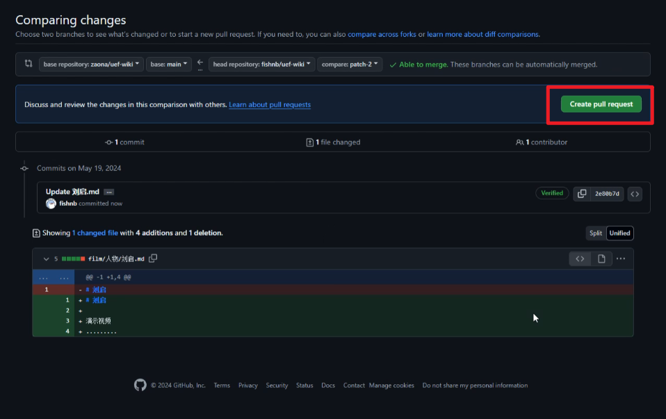
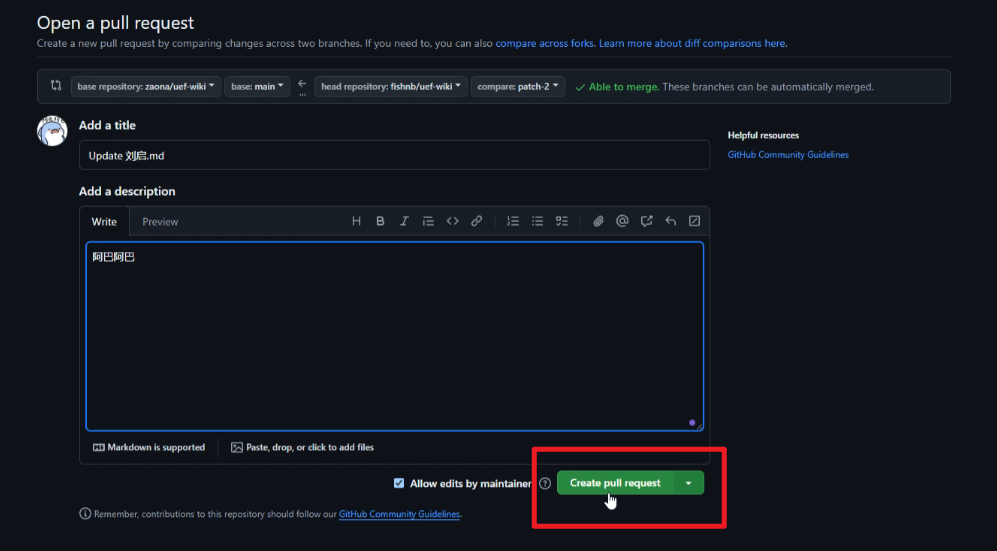
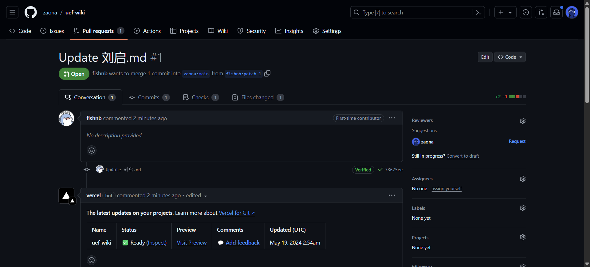
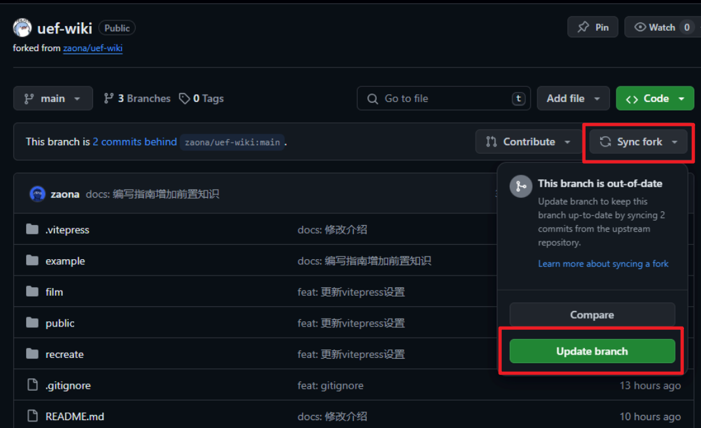

# 编写指南

## 前置知识
1. Git 是一个分布式版本控制工具，Github 是一个托管 Git 仓库的网站。

- 本站的所有内容都托管在 Github 的一个仓库上，您可以简单的通过给仓库提交 Pull Request 来贡献文档

2. 本站使用 Vitepress 搭建，所有的文档都使用 Markdown 语法

- 并且 Vitepress 针对 Markdown 进行了大量扩展，您可以在 [Vitepress 文档](https://vitepress.vuejs.org/guide/markdown) 中查看更多细节。

**这里出现了一些概念，需要您先了解：**

### Git
- Git 是一个强大的分布式版本控制系统，用于跟踪文件和整个项目的变更。
- 它允许用户记录每次修改，查看历史版本，对比不同版本的差异，以及在不同的分支上进行开发。
- Git 的核心价值在于能够帮助开发者管理代码的不同版本，支持多人协作，确保团队成员之间的代码同步和冲突解决。

### Github
- GitHub 是一个基于云的平台，提供了 Git 仓库的托管服务。
- 用户可以在 GitHub 上创建公开或私有的代码仓库，与他人共享和协作。
- 除了基本的版本控制功能，GitHub 还提供了问题追踪`Issues`、拉取请求`Pull Requests`等功能

#### Fork 和 Pull Request
- 用户可以`fork`复制别人的仓库到自己的帐户，然后提交修改并发起`Pull Request`，请求原作者合并代码。
::: tip
在实际交流中，我们通常称`Pull Request`为`PR`。
:::
::: info
在Github上，除仓库成员外，其他用户都无法直接修改仓库，只能通过`fork`仓库，然后提交`PR`来修改仓库。
:::

#### Clone 和 Pull
- 用户可以通过`clone`将远程仓库`remote`克隆到本地。
- `pull`从远程仓库`remote`拉取更新。

#### Commit 和 Push
- 用户可以在本地仓库中创建新的提交`commit`，并将更改推送到远程仓库`remote`。
- 推送`push`可以将本地提交推送到远程仓库。

::: tip
看蒙了？

没关系，这里只是基础概念，后面将给出具体操作流程，以确保你能快速上手

在熟悉操作之后再回读一遍，会更清晰~
:::


### Markdown
- Markdown是一种轻量级的标记语言，它允许人们使用易读易写的纯文本格式编写文档
- Markdown的优势在于它的简洁性和易学性，使得非程序员也能快速上手，用于编写博客、文档、笔记等。

#### Markdown 基本语法

- 标题：使用`#`符号表示不同级别的标题。
- 字体：`*斜体*`，`**粗体**`，`~~删除线~~`。
- 列表：使用`-`或`*`创建无序列表，`1.`创建有序列表。
- 链接：`[文本](URL)`。
- 图片：``。
- 代码块：使用三个反引号` ``` `包裹代码。
- 引用：`>`符号开头表示引用。
- 表格：使用`|`分隔列，`-`定义表头和分割线。

### Vitepress

- Vitepress 是一个现代静态站点生成器，它特别适合构建文档网站，也就是本站的由来

- Markdown增强: Vitepress 扩展了 Markdown 语法，提供了诸如自定义组件、代码高亮、数学公式支持等功能。

#### Markdown 拓展语法

> 您可以在 [Vitepress 文档](https://vitepress.vuejs.org/guide/markdown) 中查看关于更多内容，这里仅列出部分常用块。

**输入**

```md
::: info
This is an info box.
:::

::: tip
This is a tip.
:::

::: warning
This is a warning.
:::

::: danger
This is a dangerous warning.
:::

::: details
This is a details block.
:::
```

**输出**

::: info
::: tip
This is a tip.
:::
This is an info box.
:::

::: tip
This is a tip.
:::

::: warning
This is a warning.
:::

::: danger
This is a dangerous warning.
:::

::: details
This is a details block.
:::

## 开始编辑！
::: danger
需要提前注册好 Github 账号
:::
### STEP 1
在需要编辑的页面下方点击“在 Github 上编辑此页面”


### STEP 2
`Fork`本仓库


### STEP 3
修改文件，提交修改


### STEP 4
创建`Pull Request`




### STEP 5
等待审核


::: tip
如果主仓库有更新，你需要在 fork 的仓库中点击“同步分支”来同步主仓库的更新

:::