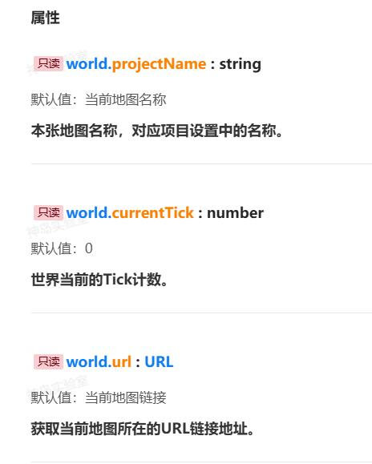

**为了规范API文档，我们统一了编写格式。接下来，我将通过一系列清晰的说明，帮助你轻松理解如何阅读API文档**


## 属性
以下的示例来自于在**游戏世界**分类下的[**地图信息**](https://www.yuque.com/box3lab/api/obl2sb5x68v08he8)。


:::warning

### projectName：string
projectName 是一个字符串类型（text），它用来表示当前地图的名称。这个名称是默认的，而且不可以通过该API进行更改地图名字。这个名称在项目设置中是可以找到的，它是你在创建或编辑地图时给地图起的名字。

### currentTick：number
currentTick 是一个数字类型，它表示“世界”当前的Tick计数。在计算机游戏中，“Tick”通常指的是游戏循环中的一次迭代或更新。所以，currentTick 就是从游戏开始到现在，游戏循环已经迭代了多少次的计数。它的默认值是0，意味着游戏刚开始时，Tick计数是0。

### url：URL
url 是一个URL类型（网址），它表示当前地图所在的链接地址。简单来说，它就像是你在网上看一个视频或者网页时，浏览器地址栏上显示的那一串字符。这个url的默认值是“当前地图链接”，也就是说，如果你打开了一个地图，那么url就会是这个地图的网址。

### 调用方式
调用这些变量或属性的方式是 world.xxx，其中 xxx 是变量或属性的名称（比如 world.projectName、world.currentTick 或 world.url）。
:::


## 方法
:::warning
`createTempChat` 这个函数是用来创建一个临时聊天频道的。它允许你在游戏中，为一些特定的玩家快速设置一个可以互相交流的临时空间。

#### 输入参数

- **id**： 
   - **必填**：否。这意味着你不需要总是提供这个参数，但如果你提供了，函数会使用这个参数来工作。
   - **默认值**：没有默认值。这意味着如果你不提供`id`参数，函数将不会默认加入任何玩家到临时频道。
   - **类型**：`string[]`，这是一个字符串数组。数组中的每个字符串都代表一个玩家的ID。
   - **说明**：当你创建临时频道时，如果你提供了`id`参数，那么这些ID对应的玩家会被自动加入这个临时频道。

#### 返回值

- **类型**：`Promise<string>`。函数会异步的返回一个字符串，这个字符串就是新创建的临时频道的ID。
- **说明**：频道ID就像是一个临时频道的“门牌号”，其他玩家（或者你的代码）可以用这个ID来找到并进入这个临时频道。

#### 调用方式
如果只创建，不加入玩家到临时频道，那么调用方式是`world.createTempChat()`

如果创建的同时需要加入玩家到临时频道，那么调用方式是`world.createTempChat(['83354','8632'])`
:::

---


:::warning
`onChat` 是一个函数，它的作用是设置一个监听器，当游戏中的玩家在聊天窗口说话时，这个监听器就会被触发。换句话说，如果你想知道游戏中某个玩家说了什么，你就可以使用这个函数来“监听”他们的聊天。

#### 输入参数

- **callback**：
   - **必填**：是。这意味着在调用onChat函数时，你必须提供一个handler参数。
   - **默认值**：没有默认值。因为这是一个必填参数，所以不提供它会导致错误。
   - **类型**：function。这个参数是一个函数，这个函数接受一个参数（即event）并且不返回任何值（即void）。
   - **说明**：handler函数会在玩家聊天时被调用，并接收一个GameChatEvent对象作为参数。你可以在这个handler函数里编写代码，来处理或响应玩家的聊天信息。

#### 返回值

- 返回一个GameEventHandlerToken类型的值，它是一个该事件生成唯一的标识符，用于后续从事件监听暂停的处理程序。

#### 调用方式
你可以通过world.onChat()的方式来调用这个函数，并传入一个处理函数作为参数。例如：
:::
```javascript
world.onChat((event) => {  
  console.log(`玩家

$$
{event.entity.player.name}说：
$$
{event.message}`);  
});
```
在上面的例子中，当玩家在聊天窗口说话时，控制台会打印出玩家的名字和他们说的话。
